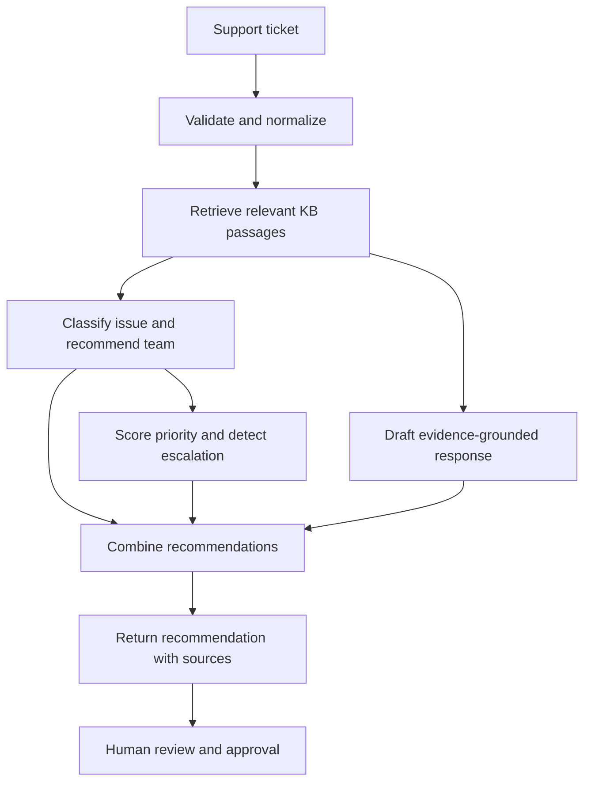

# Architecture

## Current scope

The API foundation includes a health check and a validated `POST /tickets` endpoint. Ticket submissions are acknowledged with a generated ID and timestamp, but the current endpoint does not persist ticket text or trigger processing. A local knowledge-ingestion module reads UTF-8 Markdown and plain-text files, normalizes and chunks them, and retains source metadata in memory. It does not write chunks to disk, create embeddings, or call a model. Durable storage, retrieval, and model calls remain future milestones and must not be implied by the current API.

## Target request flow

The response-generation and analysis steps may share retrieved context, but individual modules should have clear input/output contracts so they can be tested independently.

## Proposed boundaries

- **API layer:** FastAPI routes, request/response models, and HTTP error mapping.
- **Domain layer:** ticket, classification, priority, escalation, and response recommendation models and rules.
- **Knowledge layer:** document loading, normalization, chunking, indexing, retrieval, and source metadata.
- **Agent/service layer:** orchestration of classification, retrieval, priority assessment, and response drafting.
- **Provider adapters:** Anthropic/LangChain and the selected embedding/vector-store integrations; keep provider-specific code away from route handlers.
- **Evaluation layer:** test cases and metrics for retrieval relevance, recommendation quality, safety, and latency.

The initial implementation will remain a small modular Python service. Persistence, queues, and multiple services should only be introduced when validated requirements justify them.

## Safety and reliability constraints

- Human approval is required before any customer-facing response is sent or any consequential routing action is executed.
- Return source identifiers and excerpts used for suggestions so a support agent can verify the evidence.
- If retrieval is empty, weak, or contradictory, abstain or request human investigation rather than inventing policy.
- Validate model output against explicit Pydantic schemas; handle refusals, invalid output, timeouts, and provider errors.
- Treat ticket text and retrieved documents as untrusted input. Do not follow instructions embedded in customer content or KB documents that conflict with system policy.
- Keep secrets in environment configuration, never in source control. Minimize and redact personal data in logs and evaluation fixtures.
- Make priority factors and escalation rules explicit and auditable; a model score alone should not make high-impact decisions.

## Open architecture decisions

Vector database, embedding model, document storage, ticket persistence, authentication, and deployment environment remain undecided. Select them after requirements for scale, data residency, retention, and operational ownership are understood.
